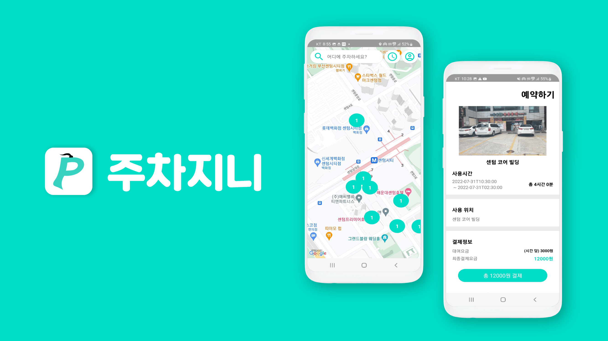
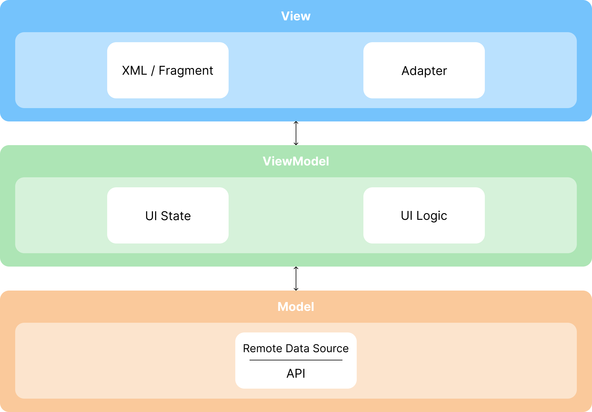

# 주차지니(ParkingGenie)

🚗 부산에는 수 많은 차들이 있고, 그 차들이 주차할 공간은 부족합니다.

주차지니는 부산의 영업시간 외 점포들과 협력하여,

**유휴 주차 공간을 공용 주차장으로 활용하는 앱**입니다.

 

## ❓ 문제 정의

- 부산은 관광, 상업 밀집 지역이 많아 주차 공간 부족, 불법 주차 등 다양한 사회문제가 발생 중임
- 반면에 일부 점포(식당, 카페, 사우나, 스크린골프장 등)은 특정 시간대에 유휴 주차 공간이 발생함
- 기존 공공 주차장의 주차 비용은 지역 가치 대비 비효율적으로 책정되어 있음

**→ 도시 내 유휴 주차 공간을 이용할 수는 없을까?**

 

## 💡 솔루션

- 점포의 유휴 주차 공간을 등록함
- 사용자의 현재 위치 주변 주차장 탐색
- 부산의 부동산 공시지가와 관광객 실태조사 공공 데이터를 기반으로 차등 요금 계산
- 예약 시간에 비례하여 요금을 계산
- 예약 생성 및 주차 이용 완료 처리

 

## ⚡ 3일간의 해커톤 과정

### 1일차

- 문제 정의, 비즈니스 모델 설계
- MVP 기능 구현 범위를 축소하기로 결정
- 예약 관련 기능에 집중하기로 결정

### 2일차

- Android MVP 개발
- Google 지도를 기반으로 주변 주차장 UI 구현
- 예약 API 설계 및 서버와 연동

### 3일차

- MVP 개발 안정화
- 사용자 플로우 점검
- 발표 데모 준비

 

## 🚀 MVP 구현 범위

### 구현 기능

- Google Maps SDK를 이용하여 위치 표시
- 현재 위치 기반으로 주변 주차장 조회
- 예약 시간에 비례하여 요금 계산
- 예약 생성 / 조회 / 주차 이용 완료 기능
- RESTful API 연동

### 제외 기능

- 실제 결제 시스템 완전 구현
- IoT 기기 기반으로 실시간 주차 빈자리 위치 감지
- 게스트(차량 주인)의 차량 정보 등록 기능
- 호스트(점포)의 주차장 관리 기능
- 주차 요금 자동 정산 시스템

 

## 👤 담당 역할

- Android 개발 담당
- 예약 기능의 플로우 설계
- MVP 기능들의 구현 범위 정의
- 아키텍쳐 설계 및 구현
- 발표 때 기술 구조 설명

 

## 🏗️ 아키텍쳐

### MVVM Architecture

- View / ViewModel / Model 계층이 분리되게 설계
- UI 상태와 UI 로직을 분리시킴
- LiveData 기반으로 상태를 관리 함
- 화면 회전 등 UI의 생명주기가 변화에도 상태를 안전하게 보존

 

## 🛠️ 기술 스택

| **Category**     | **Tech Stack**                                                                                                                                                                                                                                                                                                                         |
|------------------|----------------------------------------------------------------------------------------------------------------------------------------------------------------------------------------------------------------------------------------------------------------------------------------------------------------------------------------|
| **Language**     |                                                                                                                                                                                                                                   |
| **Platform**     |                                                                                                                                                                                                                       |
| **Architecture** |                                                                                                                                                                                                                                                                   |
| **Async**        |                                                                                                                                                                                                                                                       |
| **Networking**   | , ,                                                                                               |
| **Jetpack**      | , , ,  |
| **Infrastructure / Cloud**          | ,                                                                                  |

 

## 🔗 링크

- **Notion**  
  https://bouncy-rover-a1d.notion.site/306f88e182a580e08d68d86d3fc12fe8
